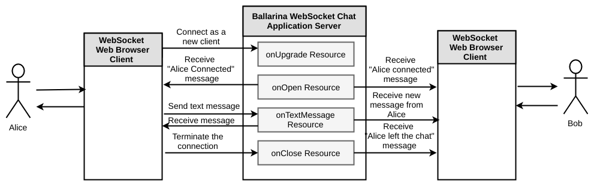

# Using WebSockets to Develop an Interactive Web Application
[WebSocket](https://tools.ietf.org/html/rfc6455) is a computer communications protocol that allows you to open an interactive communication session between the user's browser and a server. With WebSockets, you can send messages to a server and receive responses based on events without having to query the server for a response. Ballerina language has built-in support for creating services with WebSockets.

> This guide showcases how you can use WebSockets to develop an interactive web application and build the application server using Ballerina language.

The following are the sections available in this guide.

- [What you'll build](#what-you-build)
- [Prerequisites](#pre-req)
- [Developing the app](#develop-app)
- [Testing](#testing)
- [Deployment](#deploying-the-scenario)
- [Observability](#observability)

## <a name="what-you-build"></a>  What you'll build
You'll build a chat application using WebSockets. This guide instructs you how to develop the chat application server completely using Ballerina language. The Ballerina WebSocket chat application has four resources to handle WebSocket connections. Refer to the following diagram to understand the implementation of the chat application.

&nbsp;

&nbsp; 

  
NOTE: You'll use JavaScript and HTML to implement the browser client for the chat application. However, this guide only explains the JavaScript implementation of the web client.

## <a name="pre-req"></a> Prerequisites
 
* JDK 1.8 or later
* [Ballerina Distribution](https://github.com/ballerina-lang/ballerina/blob/master/docs/quick-tour.md)
* A Text Editor or an IDE

**Optional requirements**
- Ballerina IDE plugins ([IntelliJ IDEA](https://plugins.jetbrains.com/plugin/9520-ballerina), [VSCode](https://marketplace.visualstudio.com/items?itemName=WSO2.Ballerina), [Atom](https://atom.io/packages/language-ballerina))
- [Docker](https://docs.docker.com/engine/installation/)

## <a name="develop-app"></a> Develop the application
### Before you begin

#### Understand the project structure
Ballerina is a complete programming language that can have any custom project structure that you wish. Although the language allows you to have any package structure, use the following package structure for this project to follow this guide.

```
├── chatserver
│   └── chat_app.bal
└── chat_web_client
    ├── bootstrap-3
    │   ├── css
    │   │   └── bootstrap.min.css
    │   └── js
    │       └── bootstrap.min.js
    └── index.html

```

The `chatserver` is the package for the chat application server side implementation.  

The `chat_web_client` is the web client for the chat application. This guide elaborates more on the server-side implementation of the chat application using WebSockets. 

### Implementation of the chat application using WebSockets

First, you need to import the WebSocket package using the `import ballerina.net.ws;` command. Then, you can define a WebSocket web service as `service<ws> ChatApp`. You may also need to add additional WebSocket configurations using `@ws:configuration` annotation. In the chat application specify the `basePath` as `"/chat/{name}"` and `port` as `9090`.

Next, you need to add resources to handle each of the following events.
* Handshaking for a new connection
* Opening a new WebSocket
* Closing an existing WebSockets
* Receiving messages form WebSockets.

Inside each resource you can implement the logic as per the requirement. When following this guide, you will implement the chat application logic inside those resources. You can then use an in-memory map to save all the WebSocket connections. Thereafter, you can add the incoming WebSocket connection to the map inside the `onOpen` resource. Remove the WebSocket connection from the map inside the `onClose` resource and broadcast the message to all the connections in the map inside the `onTextMessage` resource. To view the complete implementation of the chat application, see the [chat_app.bal](https://github.com/ballerina-guides/websocket-integration/blob/master/chatserver/chat_app.bal) file.

#### chat_app.bal
```ballerina
package chatserver;

import ballerina.io;
import ballerina.log;
import ballerina.net.ws;


@ws:configuration {
    basePath:"/chat/{name}",
    port:9090
}
service<ws> ChatApp {
    // In-memory map to store WebSocket connections
    map consMap = {};

    //This resource triggers when a new connection handshake takes place
    resource onHandshake(ws:HandshakeConnection conn) {
        log:printInfo("New client is going to connect with ID: "+ conn.connectionID);
    }
    
    // This resource triggers when a new WebSocket connection is open
    resource onOpen (ws:Connection conn, string name) {
        // Add the new connection to the connection map
        consMap[conn.getID()] = conn;
        // Get the query parameters and path parameters to send a greeting message
        map params = conn.getQueryParams();
        var age, err = (string)params.age;
        string msg;
        if (err == null) {
            msg = string `{{name}} with age {{age}} connected to chat`;
        } else {
            msg = string `{{name}} connected to chat`;
        }
        // Broadcast the "new user connected" message to existing connections
        broadcast(consMap, msg);
    }

    // This resource triggers when a new text message arrives at the server
    resource onTextMessage (ws:Connection con, ws:TextFrame frame, string name) {
        // Create the message
        string msg = string `{{name}}: {{frame.text}}`;
        io:println(msg);
        // Broadcast the message to existing connections
        broadcast(consMap, msg);
    }

    // This resource will trigger when an existing connection closes
    resource onClose (ws:Connection con, ws:CloseFrame frame, string name) {
        // Create the client left message
        string msg = string `{{name}} left the chat`;
        // Remove the connection from the connection map
        consMap.remove(con.getID());
        // Broadcast the client left message to existing connections
        broadcast(consMap, msg);
    }
}

// Custom function to send the test to all connections in the connection map
function broadcast (map consMap, string text) {
    // Iterate through all available connections in the connections map
    foreach wsConnection in consMap {
        var con, _ = (ws:Connection)wsConnection;
        // Send the text message to the connection
        con.pushText(text);
    }
}
```

Now you have completed the implementation of the chat application web server.

### Implementation of the web client for the chat application

You can use the WebSocket API provided in JavaScript to write the web client for the chat application.

1. Create a new WebSocket connection from JavaScript.
    ```javascript
    var ws = new WebSocket("ws://localhost:9090/proxy/ws");`.
    ```

2. Listen to the following events for the WebSocket connection.
    ```javascript
    ws.onmessage = onMessageFunction
    ws.onclose = onCloseFunction
    ```
You need to display the message in the web page when a new message arrives and you should display the user disconnect message when WebSocket closes.

The following is the implementation of the `onMessageFunction` and `onCloseFunction`.

```javascript
    function onMessageFunction(msg) {
        // Display the received message in the web page
        $('#responseBox').append('<h4>' + msg.data + '</h4>');
    }

    function onCloseFunction() {
        $('#responseBox').append('<h4 style="color: red">Server closed the connection</h4>');
        $('#connectionStatus').text("connection closed.").css("color", "red");
    }
```
To send messages via WebSocket, use the following fucntion in JavaScript. 
```javascript
ws.send("text message to send");
```
You can see the complete implementation of the JavaScript web client in the [index.html](https://github.com/ballerina-guides/websocket-integration/blob/master/chat_web_client/index.html) file.

## <a name="testing"></a> Testing 

### <a name="invoking"></a> Invoking the chat application web service 

You can run the chat application server that you developed above in your local environment. You need to have the Ballerina installation on your local machine and simply point to the <ballerina>/bin/ballerina binary to execute all the following steps.  

1. Build a Ballerina executable archive (.balx) of the service that you developed above using the following command. It points to the directory structure of the service that you developed above and it will create an executable binary out of that. 
    ```
    $ ballerina build chatserver/
    ```

2. Once the chatserver.balx is created, you can run it with the following command. 
    ```
    $ ballerina run chatserver.balx  
    ```

3. The successful execution of the service results in the following output. 
    ```
    ballerina: deploying service(s) in 'chatserver.balx'
    ballerina: started HTTP/WS server connector 0.0.0.0:9090
    ```

4. You can test the functionality using the chat application web client. Navigate to the sample base directory and find the `index.html` at the `websocket-chat-app/chat_web_client/` location. Then open the index.html file from a web browser (e.g., Chrome, Firefox). You can see the following chat application user interface.
    
  
    **Connect as a new user**
    You can insert your name and age to the respective text input boxes. The client connects to the chat application once you press the `Connect` button.
    
    **Send chat messages**
    You can type new messages to the chat in the provided text box. The client sends the message to the chat application once you press the `Send` button.
    
    **Recieve chat messages**
    You can see the new messages as they arrive in the chat application client user interface.
    
    **Exit from the chat**
    You can exit from the chat application once you press the `Disconnect` button.
    
    **Join multiple clients to the chat server**
    You can log in to the chat application using multiple browsers or from the same browser. To test this, you can open multiple instances of `websocket-chat-app/chat_web_client/index.html` from your browser/s.

### <a name="unit-testing"></a> Writing Unit Tests 

In Ballerina, the unit test cases should be in the same package and the naming convention should be as follows.
* Test files should contain _test.bal suffix.
* Test functions should contain test prefix.
  * e.g., testOnMessage()

### <a name="deploying-on-docker"></a> Deploying on Docker

You can use the Ballerina executable (.balx) archive that you created above and create a docker image using the following command. 
```
ballerina docker chatserver.balx  
```

Once you have created the docker image, you can run it using docker run. 

```
docker run -p <host_port>:9090 --name ballerina_chatserver -d chatserver:latest
```

### <a name="deploying-on-k8s"></a> Deploying on Kubernetes
(Work in progress) 


## <a name="observability"></a> Observability 


### <a name="logging"></a> Logging
(Work in progress) 

### <a name="metrics"></a> Metrics
(Work in progress) 


### <a name="tracing"></a> Tracing 
(Work in progress) 
