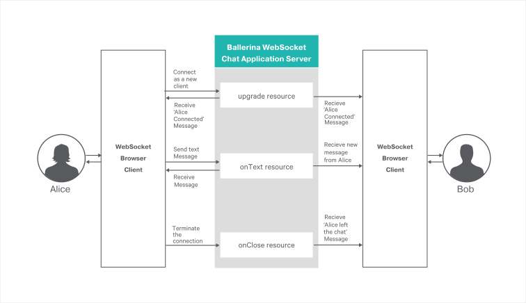
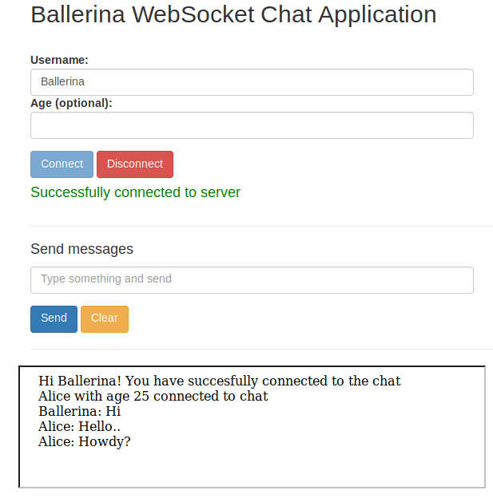

[](https://travis-ci.org/ballerina-guides/websocket-integration)
# WebSockets
[WebSocket](https://tools.ietf.org/html/rfc6455) is a computer communications protocol that allows you to open an interactive communication session between the user's browser and a server. With WebSockets, you can send messages to a server and receive responses based on events without having to query the server for a response. Ballerina language has built-in support for creating services with WebSockets.

> This guide showcases how you can use WebSockets to develop an interactive web application and build the application server using Ballerina language.

The following are the sections available in this guide.

- [What you'll build](#what-youll-build)
- [Prerequisites](#prerequisites)
- [Implementation](#implementation)
- [Testing](#testing)
- [Deployment](#deployment)
- [Observability](#observability)

## What you'll build
You'll build a chat application using WebSockets. This guide instructs you how to develop the chat application server completely using Ballerina language. The Ballerina WebSocket chat application has four resources to handle WebSocket connections. Refer to the following diagram to understand the implementation of the chat application.

&nbsp;

&nbsp; 

  
NOTE: You'll use JavaScript and HTML to implement the browser client for the chat application. However, this guide only explains the JavaScript implementation of the web client.

## Prerequisites
 
- [Ballerina Distribution](https://ballerina.io/learn/getting-started/)
- A Text Editor or an IDE

### Optional requirements
- Ballerina IDE plugins ([IntelliJ IDEA](https://plugins.jetbrains.com/plugin/9520-ballerina), [VSCode](https://marketplace.visualstudio.com/items?itemName=WSO2.Ballerina), [Atom](https://atom.io/packages/language-ballerina))
- [Docker](https://docs.docker.com/engine/installation/)
- [Kubernetes](https://kubernetes.io/docs/setup/)

## Implementation

> If you want to skip the basics, you can download the git repo and directly move to the "Testing" section by skipping  "Implementation" section.

### Create the project structure

Ballerina is a complete programming language that can have any custom project structure that you wish. Although the language allows you to have any package structure, use the following package structure for this project to follow this guide.

```
websocket-integration
  ├── guide
  |     └── chat_server
  |        ├── chat_app.bal
  |        └── tests
  |             └── chat_app_test.bal
  |
  └── chat_web_client
      ├── chatClient.js  
      └── index.html
```

The `chat_server` is the package for the chat application server side implementation.  

The `chat_web_client` is the web client for the chat application. This guide elaborates more on the server-side implementation of the chat application using WebSockets. 

- Create the above directories in your local machine and also create empty `.bal` files.

- Then open the terminal and navigate to `websocket-integration/guide` and run Ballerina project initializing toolkit.
```bash
   $ ballerina init
```

### Develop the chat application using WebSockets

First, you need to import the http package using the `import ballerina/http;` statement.

Then, you can implement the `service<http:Service> ChatAppUpgrader` to handle HTTP Upgrade requests from HTTP to WebSocket.
Before the `upgrader` resource we have given the resource configuration for the `upgrader` resource as follows,
```
    @http:ResourceConfig {
        webSocketUpgrade: {
            upgradePath: "/{name}",
            upgradeService: ChatApp
        }
    }
```
The `upgradePath: "/{name}"` statement will be the path for the chat application endpoint with `{name}` as a path parameter. ` upgradeService: ChatApp` statement will set the `ChatApp` as the WebSocket service to serve WebSocket requests.

You can define a WebSocket web service as `service<http:WebSocketService> ChatApp`. `ChatApp` WebSocket service handles the already upgraded WebSocket connections.

Next, you need to add resources to handle each of the following events.
* Opening a new WebSocket - onOpen
* Receiving messages form WebSockets - onText
* Closing an existing WebSockets - onClose

Inside each resource you can implement the logic as per the requirement. When following this guide, you will implement the chat application logic inside those resources. You can then use an in-memory map to save all the WebSocket connections. Thereafter, you can add the new incoming WebSocket connections to the in-memory map inside the `onOpen` resource. Remove the WebSocket connection from the map inside the `onClose` resource and broadcast the message to all the connections in the map inside the `onText` resource.

#### chat_app.bal
```ballerina
import ballerina/log;
import ballerina/http;

@final string USER_NAME = "USER_NAME";
@final string AGE = "AGE";

// In-memory map to save the connections
map<http:WebSocketListener> connections;

@http:ServiceConfig {
    basePath: "/chat"
}
service<http:Service> ChatAppUpgrader bind { port: 9090 } {

    // Upgrade from HTTP to WebSocket and define the service the WebSocket client
    @http:ResourceConfig {
        webSocketUpgrade: {
            upgradePath: "/{username}",
            upgradeService: ChatApp
        }
    }
    upgrader(endpoint caller, http:Request req, string username) {
        endpoint http:WebSocketListener wsCaller;
        map<string> headers;
        wsCaller = caller->acceptWebSocketUpgrade(headers);

        // Validate if username is unique
        if (!connections.hasKey(username)){
            wsCaller.attributes[USER_NAME] = username;
        } else {
            wsCaller->close(statusCode = 1003, reason = "Username already exists.") but {
                error e => log:printError("Error sending message", err = e)
            };
            done;
        }

        // Check if the age parameter is available and if so add it to the attributes
        string broadCastMsg;
        match req.getQueryParams()["age"] {
            string age => {
                wsCaller.attributes[AGE] = age;
                broadCastMsg = string `{{username}} with age {{age}} connected to chat`;
            }
            () => {
                broadCastMsg = string `{{username}} connected to chat`;

            }
        }

        // Inform the current user
        wsCaller->pushText("Hi " + username + "! You have succesfully connected to the chat") but {
            error e => log:printError("Error sending message", err = e)
        };

        // Broadcast the "new user connected" message to existing connections
        broadcast(broadCastMsg);

        // Adding the new username to the connections map after broadcasting
        connections[username] = wsCaller;
    }
}


service<http:WebSocketService> ChatApp {

    // This resource will trigger when a new text message arrives to the chat server
    onText(endpoint caller, string text) {
        // Prepare the message
        string msg = string `{{getAttributeStr(caller, USER_NAME)}}: {{text}}`;
        // Broadcast the message to existing connections
        broadcast(msg);
        // Print the message in the server console
        log:printInfo(msg);
    }

    // This resource will trigger when a existing connection closes
    onClose(endpoint caller, int statusCode, string reason) {
        // Remove the client from the in memory map
        _ = connections.remove(getAttributeStr(caller, USER_NAME));
        // Prepare the client left message
        string msg = string `{{getAttributeStr(caller, USER_NAME)}} left the chat`;
        // Broadcast the message to existing connections
        broadcast(msg);
    }
}

// Send the text to all connections in the connections map
function broadcast(string text) {
    endpoint http:WebSocketListener caller;
    // Iterate through all available connections in the connections map
    foreach id, conn in connections {
        caller = conn;
        // Push the text message to the connection
        caller->pushText(text) but {
            error e => log:printError("Error sending message")
        };
    }
}

// Gets attribute for given key from a WebSocket endpoint
function getAttributeStr(http:WebSocketListener ep, string key) returns (string) {
    return <string>ep.attributes[key];
}
```

Now you have completed the implementation of the chat application web server.

### Implementation of the web client for the chat application

You can use the WebSocket API provided in JavaScript to write the web client for the chat application.

1. Create a new WebSocket connection from JavaScript.
    ```javascript
    var ws = new WebSocket("ws://localhost:9090/chat/Alice?age=20");`.
    ```
    
2. Listen to the following events of the WebSocket connection.
    ```javascript
    ws.onmessage = onMessage
    ws.onclose = onClose
    ```

When a new message arrives and when the connection is terminated it has to be displayed on the web page.

The following is the implementation of the `onMessage` and `onClose` functions.

```javascript
    function onMessage(msg) {
        text = msg.data;
        // Display the received message in the web page
        if (text) {
            iframe.write(text+"<br>");
            document.getElementById("responseBox").contentWindow.scrollByPages(1);
        }
    }
    
    function onClose(evt) {
        if(evt.reason){
                $('#connectionStatus').text("Disconnected from chat: "+evt.reason).css("color", "red");
            }else {
                $('#connectionStatus').text("Disconnected from chat.").css("color", "red");
            }
    
        // Set the client initiated close status to false
        closeStatus = false;
    
        //close iframe used for writing
        iframe.close();
    }
```

To send messages via WebSocket, use the following function in JavaScript. 
```javascript
ws.send("Text message to send");
```

You can see the complete implementation of the JavaScript web client in the [chatClient.js](chat_web_client/chatClient.js) file.

## Testing 

### Invoking the chat application web service 

You can run the chat application service that you developed above, in your local environment. Open your terminal and navigate to `websocket-integration/guide`, and execute the following command.

```
$ ballerina run chat_server
```

- You can test the functionality using the chat application web client. Navigate to the sample base directory inside the git repo and find the `index.html` at the `websocket-chat-app/chat_web_client/` location.
Then open the index.html file from a web browser (e.g., Chrome, Firefox). You can see the following chat application user interface.
    
  
**Connect as a new user**
    You can insert your name and age to the respective text input boxes. The client connects to the chat application once you press the `Connect` button.
    
**Send chat messages**
    You can type new messages to the chat in the provided text box. The client sends the message to the chat application once you press the `Send` button.
    
**Recieve chat messages**
    You can see the new messages as they arrive in the chat application client user interface.
    
**Exit from the chat**
    You can exit from the chat application once you press the `Disconnect` button.
    
**Join multiple clients to the chat server**
    You can log in to the chat application using multiple browsers or from the same browser. To test this, you can open multiple instances of `websocket-chat-app/chat_web_client/index.html` from your browser/s.

### Writing unit tests 

In Ballerina, the unit test cases should be in the same package inside a folder named as 'tests'.  When writing the test functions the below convention should be followed.
- Test functions should be annotated with `@test:Config`. See the below example.
```ballerina
   @test:Config
   function testChatServer() {
```
  
To run the unit tests, open your terminal and navigate to `websocket-integration/guide`, and run the following command.
```bash
$ ballerina test
```

To check the implementation of the test file, refer to the [chat_app_test.bal](guide/chat_server/tests/chat_app_test.bal).

## Deployment
Once you are done with the development, you can deploy the service using any of the methods that we listed below. 

### Deploying locally

- As the first step you can build a Ballerina executable archive (.balx) of the service that we developed above. Navigate to `websocket-integration/guide` and run the following command. 
```
   $ ballerina build chat_server
```

- Once the chat_server.balx is created inside the target folder, you can run that with the following command. 
```
   $ ballerina run target/chat_server.balx
```

- The successful execution of the service will show us the following output. 
```
   ballerina: initiating service(s) in 'target/chat_server.balx'
   ballerina: started HTTP/WS endpoint 0.0.0.0:9090
```


### Deploying on Docker

You can run the service that we developed above as a docker container. As Ballerina platform offers native support for running ballerina programs on containers, you just need to put the corresponding docker annotations on your service code. 

- In our chat_app, we need to import  `` import ballerinax/docker; `` and use the annotation `` @docker:Config `` as shown below to enable docker image generation during the build time. 

##### chat_app.bal
```ballerina
import ballerina/http;
import ballerinax/docker;

@docker:Config {
    registry:"ballerina.guides.io",
    name:"chat_app",
    tag:"v1.0"
}
@docker:Expose{}
endpoint http:ServiceEndpoint ep {
    port:9090
};

// Define constants

@http:WebSocketServiceConfig {
    basePath:"/chat"
}
service<http:WebSocketService> ChatApp bind ep {
``` 

- Now you can build a Ballerina executable archive (.balx) of the service that we developed above, using the following command. It points to the service file that we developed above and it will create an executable binary out of that. 
This will also create the corresponding docker image using the docker annotations that you have configured above. Navigate to the `<SAMPLE_ROOT>/src/` folder and run the following command.  
  
```
$ballerina build chat_server

Run following command to start docker container: 
docker run -d -p 9090:9090 ballerina.guides.io/chat_app:v1.0
```

- Once you successfully build the docker image, you can run it with the `` docker run`` command that is shown in the previous step.  

```   
docker run -d -p 9090:9090 ballerina.guides.io/chat_app:v1.0
```

  Here we run the docker image with flag`` -p <host_port>:<container_port>`` so that we  use  the host port 9090 and the container port 9090. Therefore you can access the service through the host port. 

- Verify docker container is running with the use of `` $ docker ps``. The status of the docker container should be shown as 'Up'.

- You can test this service using the same way we followed earlier.


### Deploying on Kubernetes

- You can run the service that we developed above, on Kubernetes. The Ballerina language offers native support for running a ballerina programs on Kubernetes, 
with the use of Kubernetes annotations that you can include as part of your service code. Also, it will take care of the creation of the docker images. 
So you don't need to explicitly create docker images prior to deploying it on Kubernetes.   

- We need to import `` import ballerinax/kubernetes; `` and use `` @kubernetes `` annotations as shown below to enable kubernetes deployment for the service we developed above. 

##### chat_app.bal

```ballerina
import ballerina/http;
import ballerinax/kubernetes;

@kubernetes:Ingress {
    hostname:"ballerina.guides.io",
    name:"ballerina-guides-chat-app",
    path:"/"
}

@kubernetes:Service {
    serviceType:"NodePort",
    name:"ballerina-guides-chat-app"
}

@kubernetes:Deployment {
    image:"ballerina.guides.io/chat_app:v1.0",
    name:"ballerina-guides-chat-app"
}

endpoint http:ServiceEndpoint ep {
    port:9090
};

// Define constants

@http:WebSocketServiceConfig {
    basePath:"/chat"
}
service<http:WebSocketService> ChatApp bind ep {    
``` 

- Here we have used ``  @kubernetes:Deployment `` to specify the docker image name which will be created as part of building this service. 
- We have also specified `` @kubernetes:Service `` so that it will create a Kubernetes service which will expose the Ballerina service that is running on a Pod.  
- In addition we have used `` @kubernetes:Ingress `` which is the external interface to access your service (with path `` /`` and host name ``ballerina.guides.io``)

If you are using Minikube, you need to set a couple of additional attributes to the `@kubernetes:Deployment` annotation. 
- `dockerCertPath` - The path to the certificates directory of Minikube (e.g., `/home/ballerina/.minikube/certs`). 
- `dockerHost` - The host for the running cluster (e.g., `tcp://192.168.99.100:2376`). The IP address of the cluster can be found by running the `minikube ip` command.

Now you can build a Ballerina executable archive (.balx) of the service that we developed above, using the following command. It points to the service file that we developed above and it will create an executable binary out of that. 
This will also create the corresponding docker image and the Kubernetes artifacts using the Kubernetes annotations that you have configured above.
  
```
$ ballerina build chat_server

Run following command to deploy kubernetes artifacts:  
kubectl apply -f ./target/kubernetes//chat_server
```

- You can verify that the docker image that we specified in `` @kubernetes:Deployment `` is created, by using `` docker ps images ``. 
- Also the Kubernetes artifacts related our service, will be generated in `` ./target/kubernetes/chat_app``. 
- Now you can create the Kubernetes deployment using:

```
$ kubectl apply -f ./target/kubernetes/chat_server 

deployment.extensions "ballerina-guides-chat-app" created
ingress.extensions "ballerina-guides-chat-app" created
service "ballerina-guides-chat-app" created
```

- You can verify Kubernetes deployment, service and ingress are running properly, by using following Kubernetes commands. 
```
$ kubectl get service
$ kubectl get deploy
$ kubectl get pods
$ kubectl get ingress
```

 If everything is successfully deployed, you can invoke the service either via Node port or ingress. If you are using Minikube, you should use the IP address of the Minikube cluster obtained by running the `minikube ip` command. The port should be the node port obtained when running the `kubectl get services` command. Change the following line in `chat_app.bal` at the `websocket-chat-app/chat_web_client/`
```javascript
    var url = "ws://localhost:9090/chat/";
```
to
```javascript
    var url = "ws://<IP>:<NODE_PORT>/chat/";
```
## Observability 
Ballerina is by default observable. Meaning you can easily observe your services, resources, etc.
However, observability is disabled by default via configuration. Observability can be enabled by adding following configurations to `ballerina.conf` file and starting the ballerina service using it. A sample configuration file can be found in `websocket-integration/guide/chat_server`.

```ballerina
[b7a.observability]

[b7a.observability.metrics]
# Flag to enable Metrics
enabled=true

[b7a.observability.tracing]
# Flag to enable Tracing
enabled=true
```
To start the ballerina service using the configuration file, run the following command

```
   $ ballerina run --config chat_server/ballerina.conf chat_server/
```
NOTE: The above configuration is the minimum configuration needed to enable tracing and metrics. With these configurations default values are load as the other configuration parameters of metrics and tracing.

### Tracing 

You can monitor ballerina services using in built tracing capabilities of Ballerina. We'll use [Jaeger](https://github.com/jaegertracing/jaeger) as the distributed tracing system.
Follow the following steps to use tracing with Ballerina.

- You can add the following configurations for tracing. Note that these configurations are optional if you already have the basic configuration in `ballerina.conf` as described above.
```
   [b7a.observability]

   [b7a.observability.tracing]
   enabled=true
   name="jaeger"

   [b7a.observability.tracing.jaeger]
   reporter.hostname="localhost"
   reporter.port=5775
   sampler.param=1.0
   sampler.type="const"
   reporter.flush.interval.ms=2000
   reporter.log.spans=true
   reporter.max.buffer.spans=1000
```

- Run Jaeger docker image using the following command
```bash
   $ docker run -d -p5775:5775/udp -p6831:6831/udp -p6832:6832/udp -p5778:5778 -p16686:16686 \
   -p14268:14268 jaegertracing/all-in-one:latest
```

- Navigate to `websocket-integration/guide` and run the restful-service using the following command
```
   $ ballerina run --config chat_server/ballerina.conf chat_server/
```

- Observe the tracing using Jaeger UI using following URL
```
   http://localhost:16686
```

### Metrics
Metrics and alarts are built-in with ballerina. We will use Prometheus as the monitoring tool.
Follow the below steps to set up Prometheus and view metrics for Ballerina restful service.

- You can add the following configurations for metrics. Note that these configurations are optional if you already have the basic configuration in `ballerina.conf` as described under `Observability` section.

```ballerina
   [b7a.observability.metrics]
   enabled=true
   provider="micrometer"

   [b7a.observability.metrics.micrometer]
   registry.name="prometheus"

   [b7a.observability.metrics.prometheus]
   port=9700
   hostname="0.0.0.0"
   descriptions=false
   step="PT1M"
```

- Create a file `prometheus.yml` inside `/tmp/` location. Add the below configurations to the `prometheus.yml` file.
```
   global:
     scrape_interval:     15s
     evaluation_interval: 15s

   scrape_configs:
     - job_name: prometheus
       static_configs:
         - targets: ['172.17.0.1:9797']
```

   NOTE : Replace `172.17.0.1` if your local docker IP differs from `172.17.0.1`
   
- Run the Prometheus docker image using the following command
```
   $ docker run -p 19090:9090 -v /tmp/prometheus.yml:/etc/prometheus/prometheus.yml \
   prom/prometheus
```

- Navigate to `websocket-integration/guide` and run the restful-service using the following command
```
   $ ballerina run --config chat_server/ballerina.conf chat_server/
```

- You can access Prometheus at the following URL
```
   http://localhost:19090/
```

NOTE:  Ballerina will by default have following metrics for HTTP server connector. You can enter following expression in Prometheus UI
-  http_requests_total
-  http_response_time


### Logging

Ballerina has a log package for logging to the console. You can import ballerina/log package and start logging. The following section will describe how to search, analyze, and visualize logs in real time using Elastic Stack.

- Start the Ballerina Service with the following command from `websocket-integration/guide`
```
   $ nohup ballerina run chat_server/ &>> ballerina.log&
```
   NOTE: This will write the console log to the `ballerina.log` file in the `restful-service/guide` directory

- Start Elasticsearch using the following command

- Start Elasticsearch using the following command
```
   $ docker run -p 9200:9200 -p 9300:9300 -it -h elasticsearch --name \
   elasticsearch docker.elastic.co/elasticsearch/elasticsearch:6.2.2 
```

   NOTE: Linux users might need to run `sudo sysctl -w vm.max_map_count=262144` to increase `vm.max_map_count` 
   
- Start Kibana plugin for data visualization with Elasticsearch
```
   $ docker run -p 5601:5601 -h kibana --name kibana --link \
   elasticsearch:elasticsearch docker.elastic.co/kibana/kibana:6.2.2     
```

- Configure logstash to format the ballerina logs

i) Create a file named `logstash.conf` with the following content
```
input {  
 beats{ 
     port => 5044 
 }  
}

filter {  
 grok{  
     match => { 
	 "message" => "%{TIMESTAMP_ISO8601:date}%{SPACE}%{WORD:logLevel}%{SPACE}
	 \[%{GREEDYDATA:package}\]%{SPACE}\-%{SPACE}%{GREEDYDATA:logMessage}"
     }  
 }  
}   

output {  
 elasticsearch{  
     hosts => "elasticsearch:9200"  
     index => "store"  
     document_type => "store_logs"  
 }  
}  
```

ii) Save the above `logstash.conf` inside a directory named as `{SAMPLE_ROOT}\pipeline`
     
iii) Start the logstash container, replace the {SAMPLE_ROOT} with your directory name
     
```
$ docker run -h logstash --name logstash --link elasticsearch:elasticsearch \
-it --rm -v ~/{SAMPLE_ROOT}/pipeline:/usr/share/logstash/pipeline/ \
-p 5044:5044 docker.elastic.co/logstash/logstash:6.2.2
```
  
 - Configure filebeat to ship the ballerina logs
    
i) Create a file named `filebeat.yml` with the following content
```
filebeat.prospectors:
- type: log
  paths:
    - /usr/share/filebeat/ballerina.log
output.logstash:
  hosts: ["logstash:5044"]  
```
NOTE : Modify the ownership of filebeat.yml file using `$chmod go-w filebeat.yml` 

ii) Save the above `filebeat.yml` inside a directory named as `{SAMPLE_ROOT}\filebeat`   
        
iii) Start the logstash container, replace the {SAMPLE_ROOT} with your directory name
     
```
$ docker run -v {SAMPLE_ROOT}/filebeat/filebeat.yml:/usr/share/filebeat/filebeat.yml \
-v {SAMPLE_ROOT}/guide.restful_service/restful_service/ballerina.log:/usr/share\
/filebeat/ballerina.log --link logstash:logstash docker.elastic.co/beats/filebeat:6.2.2
```
 
 - Access Kibana to visualize the logs using following URL
```
   http://localhost:5601 
```
  
 

