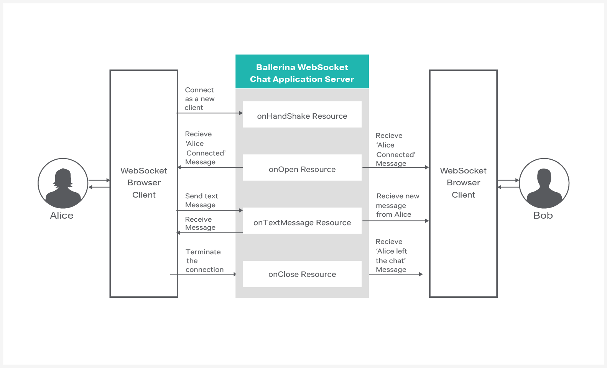

[](https://travis-ci.org/rosensilva/websocket-integration)
# WebSockets
[WebSocket](https://tools.ietf.org/html/rfc6455) is a computer communications protocol that allows you to open an interactive communication session between the user's browser and a server. With WebSockets, you can send messages to a server and receive responses based on events without having to query the server for a response. Ballerina language has built-in support for creating services with WebSockets.

> This guide showcases how you can use WebSockets to develop an interactive web application and build the application server using Ballerina language.

The following are the sections available in this guide.

- [What you'll build](#what-youll-build)
- [Prerequisites](#prerequisites)
- [Developing the app](#develop-the-websocket-application)
- [Testing](#testing)
- [Deployment](#deployment)

## What you'll build
You'll build a chat application using WebSockets. This guide instructs you how to develop the chat application server completely using Ballerina language. The Ballerina WebSocket chat application has four resources to handle WebSocket connections. Refer to the following diagram to understand the implementation of the chat application.

&nbsp;

&nbsp; 

  
NOTE: You'll use JavaScript and HTML to implement the browser client for the chat application. However, this guide only explains the JavaScript implementation of the web client.

## Prerequisites
 
* JDK 1.8 or later
* [Ballerina Distribution](https://github.com/ballerina-lang/ballerina/blob/master/docs/quick-tour.md)
* A Text Editor or an IDE

**Optional requirements**
- Ballerina IDE plugins ([IntelliJ IDEA](https://plugins.jetbrains.com/plugin/9520-ballerina), [VSCode](https://marketplace.visualstudio.com/items?itemName=WSO2.Ballerina), [Atom](https://atom.io/packages/language-ballerina))
- [Docker](https://docs.docker.com/engine/installation/)

## Develop the websocket application
### Before you begin

#### Understand the project structure
Ballerina is a complete programming language that can have any custom project structure that you wish. Although the language allows you to have any package structure, use the following package structure for this project to follow this guide.

```
├── src
|   └── chatserver
|        └── chat_app.bal
|
└── chat_web_client
    ├── bootstrap-3
    │   ├── css
    │   │   └── bootstrap.min.css
    │   └── js
    │       └── bootstrap.min.js
    └── index.html

```

The `chatserver` is the package for the chat application server side implementation.  

The `chat_web_client` is the web client for the chat application. This guide elaborates more on the server-side implementation of the chat application using WebSockets. 

### Implementation of the chat application using WebSockets

First, you need to import the http package using the `import ballerina/net.http;` statement. Then, you can define a WebSocket web service as `service<http:WebSocketService> ChatApp`. You may also need to add additional WebSocket configurations using `@http:WebSocketServiceConfig` annotation. In the chat application specify the `basePath` as `/chat`.

Next, you need to add resources to handle each of the following events.
* Upgrading http connection to WebSocket conenction
* Opening a new WebSocket
* Receiving messages form WebSockets
* Closing an existing WebSockets

Inside each resource you can implement the logic as per the requirement. When following this guide, you will implement the chat application logic inside those resources. You can then use an in-memory map to save all the WebSocket connections. Thereafter, you can add the new incoming WebSocket connections to the in-memory map inside the `onOpen` resource. Remove the WebSocket connection from the map inside the `onClose` resource and broadcast the message to all the connections in the map inside the `onTextMessage` resource. To view the complete implementation of the chat application, see the [chat_app.bal](https://github.com/ballerina-guides/websocket-integration/blob/master/chatserver/chat_app.bal) file.

#### chat_app.bal
```ballerina
package chatserver;

import ballerina/io;
import ballerina/net.http;

const string NAME = "NAME";
const string AGE = "AGE";

// Define an endpoint to the chat application
endpoint http:ServiceEndpoint ep {
    port:9090
};

@http:WebSocketServiceConfig {
    basePath:"/chat"
}
service<http:WebSocketService> ChatApp bind ep {
// In-memory map to store web socket connections
    map<http:WebSocketConnector> consMap = {};
    string msg;

// This resource will trigger when a new connection upgrades to WebSockets
    onUpgrade(endpoint ep, http:Request req) {
        // Get the query parameters and path parameters to set the greeting message
        var params = req.getQueryParams();
        string name = untaint <string>params.name;
        if (name != null) {
            // If client connected with a name
            ep.getClient().attributes[NAME] = name;
            msg = string `{{name}} connected to chat`;
        } else {
            // Throw an error if client connected without a name
            error err = {message:"Please enter a name"};
            throw err;
        }
        string age = untaint <string>params.age;

        if (age != null) {
            // If client has given a age display it in greeting message
            ep.getClient().attributes[AGE] = age;
            msg = string `{{name}} with age {{age}} connected to chat`;
        }
    }

// This resource will trigger when a new web socket connection is open
    onOpen(endpoint ep) {
        // Get the WebSocket client from the endpoint
        var conn = ep.getClient();
        // Add the new connection to the connection map
        consMap[conn.id] = conn;
        // Broadcast the "new user connected" message to existing connections
        broadcast(consMap, msg);
        // Print the message in the server console
        io:println(msg);
    }

// This resource wil trigger when a new text message arrives to the chat server
    onTextMessage(endpoint ep, http:TextFrame frame) {
        // Prepare the message
        msg = untaint string `{{untaint <string>ep.getClient().attributes[NAME]}}:
         {{frame.text}}`;
        // Broadcast the message to existing connections
        broadcast(consMap, msg);
        // Print the message in the server console
        io:println(msg);
    }

// This resource will trigger when a existing connection closed
    onClose(endpoint ep, http:CloseFrame frame) {
        var con = ep.getClient();
        // Prepare the client left message
        msg = string `{{untaint <string>ep.getClient().attributes[NAME]}} left the chat`;
        // Remove the client from the in memory map
        _ = consMap.remove(con.id);
        // Broadcast the message to existing connections
        broadcast(consMap, msg);
        // Print the message in the server console
        io:println(msg);
    }
}

// Custom function to send the test to all connections in the connection map
function broadcast(map<http:WebSocketConnector> consMap, string text) {
    // Iterate through all available connections in the connections map
    foreach con in consMap {
        // Push the text message to the connection
        con.pushText(text);
    }
}
```

Now you have completed the implementation of the chat application web server.

### Implementation of the web client for the chat application

You can use the WebSocket API provided in JavaScript to write the web client for the chat application.

1. Create a new WebSocket connection from JavaScript.
```javascript
var ws = new WebSocket("ws://localhost:9090/chat?name=Alice&age=20");`.
```

2. Listen to the following events for the WebSocket connection.
```javascript
ws.onmessage = onMessageFunction
ws.onclose = onCloseFunction
```
You need to display the message in the web page when a new message arrives and you should display the user disconnect message when WebSocket closes.

The following is the implementation of the `onMessageFunction` and `onCloseFunction`.

```javascript
    function onMessageFunction(msg) {
        // Display the received message in the web page
        $('#responseBox').append('<h4>' + msg.data + '</h4>');
    }

    function onCloseFunction() {
        $('#responseBox').append('<h4 style="color: red">Server closed the connection</h4>');
        $('#connectionStatus').text("connection closed.").css("color", "red");
    }
```

To send messages via WebSocket, use the following fucntion in JavaScript. 
```javascript
ws.send("text message to send");
```

You can see the complete implementation of the JavaScript web client in the [index.html](https://github.com/ballerina-guides/websocket-integration/blob/master/chat_web_client/index.html) file.

## Testing 

### Invoking the chat application web service 

You can run the chat application server that you developed above in your local environment. You need to have the Ballerina installation on your local machine and simply point to the <ballerina>/bin/ballerina binary to execute all the following steps.  

1. Build a Ballerina executable archive (.balx) of the service that you developed above using the following command. It points to the directory structure of the service that you developed above and it will create an executable binary out of that. 
```
$ ballerina build chatserver/
```

2. Once the chatserver.balx is created, you can run it with the following command. 
```
$ ballerina run chatserver.balx  
```

3. The successful execution of the service results in the following output. 
```
ballerina: deploying service(s) in 'chatserver.balx'
ballerina: started HTTP/WS server connector 0.0.0.0:9090
```

4. You can test the functionality using the chat application web client. Navigate to the sample base directory and find the `index.html` at the `websocket-chat-app/chat_web_client/` location. Then open the index.html file from a web browser (e.g., Chrome, Firefox). You can see the following chat application user interface.
    
  
    **Connect as a new user**
    You can insert your name and age to the respective text input boxes. The client connects to the chat application once you press the `Connect` button.
    
    **Send chat messages**
    You can type new messages to the chat in the provided text box. The client sends the message to the chat application once you press the `Send` button.
    
    **Recieve chat messages**
    You can see the new messages as they arrive in the chat application client user interface.
    
    **Exit from the chat**
    You can exit from the chat application once you press the `Disconnect` button.
    
    **Join multiple clients to the chat server**
    You can log in to the chat application using multiple browsers or from the same browser. To test this, you can open multiple instances of `websocket-chat-app/chat_web_client/index.html` from your browser/s.

### Writing Unit Tests 

In Ballerina, the unit test cases should be in the same package and the naming convention should be as follows.
* Test files should contain _test.bal suffix.
* Test functions should contain test prefix.
  * e.g., testOnMessage()

## Deployment

### Deploying on Docker

You can run the service that we developed above as a docker container. As Ballerina platform offers native support for running ballerina programs on containers, you just need to put the corresponding docker annotations on your service code. 

- In our chat_app, we need to import  `` import ballerinax/docker; `` and use the annotation `` @docker:Config `` as shown below to enable docker image generation during the build time. 

##### chat_app.bal
```ballerina
package chatserver;

import ballerina/http;
import ballerinax/docker;

@docker:Config {
    registry:"ballerina.guides.io",
    name:"chat_app",
    tag:"v1.0"
}

endpoint http:ServiceEndpoint ep {
    port:9090
};

// Define constants

@http:WebSocketServiceConfig {
    basePath:"/chat"
}
service<http:WebSocketService> ChatApp bind ep {
``` 

- Now you can build a Ballerina executable archive (.balx) of the service that we developed above, using the following command. It points to the service file that we developed above and it will create an executable binary out of that. 
This will also create the corresponding docker image using the docker annotations that you have configured above. Navigate to the `<SAMPLE_ROOT>/src/` folder and run the following command.  
  
```
$ballerina build chatserver

Run following command to start docker container: 
docker run -d -p 9090:9090 ballerina.guides.io/chat_app:v1.0
```

- Once you successfully build the docker image, you can run it with the `` docker run`` command that is shown in the previous step.  

```   
docker run -d -p 9090:9090 ballerina.guides.io/chat_app:v1.0
```

  Here we run the docker image with flag`` -p <host_port>:<container_port>`` so that we  use  the host port 9090 and the container port 9090. Therefore you can access the service through the host port. 

- Verify docker container is running with the use of `` $ docker ps``. The status of the docker container should be shown as 'Up'.

- You can test this service using the same way we followed earlier.


### Deploying on Kubernetes

- You can run the service that we developed above, on Kubernetes. The Ballerina language offers native support for running a ballerina programs on Kubernetes, 
with the use of Kubernetes annotations that you can include as part of your service code. Also, it will take care of the creation of the docker images. 
So you don't need to explicitly create docker images prior to deploying it on Kubernetes.   

- We need to import `` import ballerinax/kubernetes; `` and use `` @kubernetes `` annotations as shown below to enable kubernetes deployment for the service we developed above. 

##### chat_app.bal

```ballerina
package chatserver;

import ballerina/http;
import ballerinax/kubernetes;

@kubernetes:Ingress {
    hostname:"ballerina.guides.io",
    name:"ballerina-guides-chat-app",
    path:"/"
}

@kubernetes:Service {
    serviceType:"NodePort",
    name:"ballerina-guides-chat-app"
}

@kubernetes:Deployment {
    image:"ballerina.guides.io/chat_app:v1.0",
    name:"ballerina-guides-chat-app"
}

endpoint http:ServiceEndpoint ep {
    port:9090
};

// Define constants

@http:WebSocketServiceConfig {
    basePath:"/chat"
}
service<http:WebSocketService> ChatApp bind ep {    
``` 

- Here we have used ``  @kubernetes:Deployment `` to specify the docker image name which will be created as part of building this service. 
- We have also specified `` @kubernetes:Service {} `` so that it will create a Kubernetes service which will expose the Ballerina service that is running on a Pod.  
- In addition we have used `` @kubernetes:Ingress `` which is the external interface to access your service (with path `` /`` and host name ``ballerina.guides.io``)

- Now you can build a Ballerina executable archive (.balx) of the service that we developed above, using the following command. It points to the service file that we developed above and it will create an executable binary out of that. 
This will also create the corresponding docker image and the Kubernetes artifacts using the Kubernetes annotations that you have configured above.
  
```
$ballerina build chatserver

Run following command to deploy kubernetes artifacts:  
kubectl apply -f ./target/chatserver/kubernetes
```

- You can verify that the docker image that we specified in `` @kubernetes:Deployment `` is created, by using `` docker ps images ``. 
- Also the Kubernetes artifacts related our service, will be generated in `` ./target/chatserver/kubernetes``. 
- Now you can create the Kubernetes deployment using:

```
$kubectl apply -f ./target/chatserver/kubernetes 

deployment.extensions "ballerina-guides-chat-app" created
ingress.extensions "ballerina-guides-chat-app" created
service "ballerina-guides-chat-app" created
```

- You can verify Kubernetes deployment, service and ingress are running properly, by using following Kubernetes commands. 
```
$kubectl get service
$kubectl get deploy
$kubectl get pods
$kubectl get ingress
```

- If everything is successfully deployed, you can invoke the service either via Node port or ingress. 

